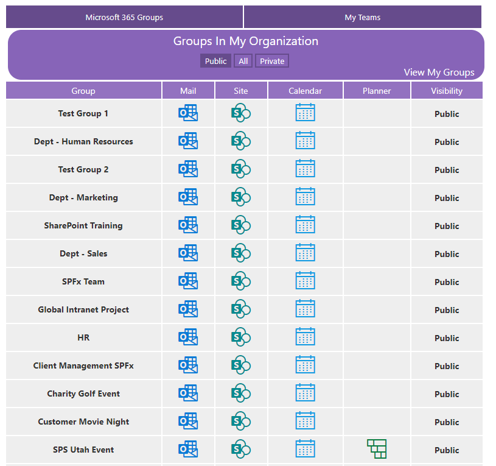
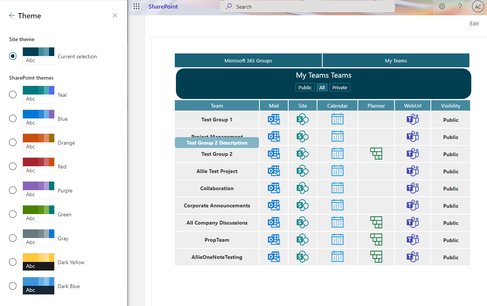
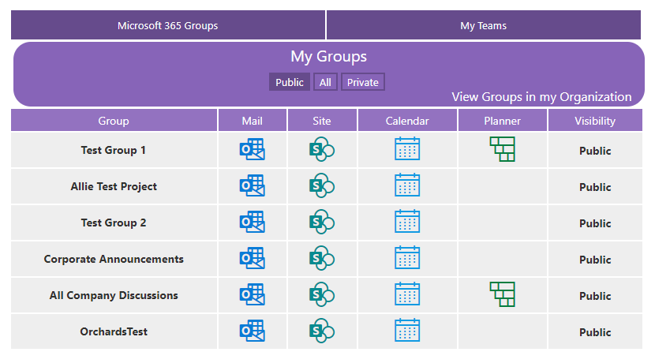
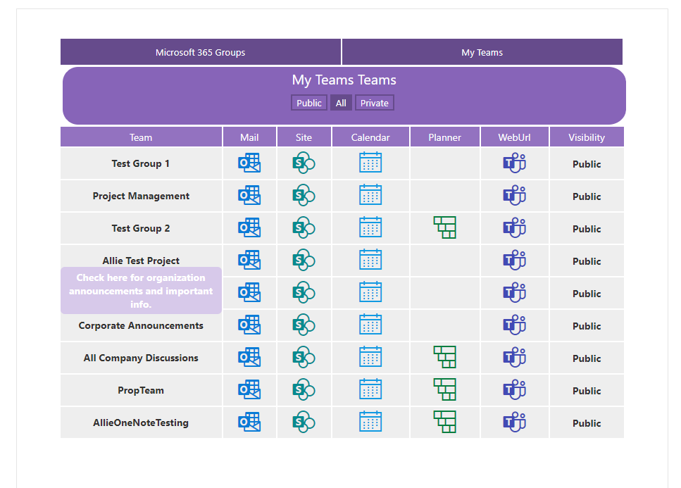

## All Microsoft 365 Groups and Teams with SPFx

### Summary
Web part pulls all Microsoft 365 Groups and Teams that the logged in user has access to view.
1. The Microsoft Groups view has filter option for private or public groups and can switch between viewing all groups or just my groups. 
 - Group Name (hover for group description)
 - Link to email
 - Link to SharePoint site
 - Link to calendar
 - Link to Planner plan (if available) 
 - Group privacy
2. The Microsoft Teams view has filter option for private or public Teams.
 - Team Name (hover for group description)
 - Link to email
 - Link to SharePoint site
 - Link to calendar
 - Link to Planner plan (if available)
 - Link to Team
 - Team privacy
   Each Team o Uses SharePoint theme. 






## Compatibility

 

 


## Applies to

* [SharePoint Framework Developer Preview](https://docs.microsoft.com/sharepoint/dev/spfx/sharepoint-framework-overview)
* [SharePoint Framework](https://docs.microsoft.com/sharepoint/dev/spfx/sharepoint-framework-overview)

## Solution

Solution|Author(s)
--------|---------
React-Groups-Teams | [Alison Collins](https://github.com/ReactIntern)      |

## Version history

| Version | Date             | Comments        |
| ------- | ---------------- | --------------- |
| 1.0.0   | April 16, 2021 | Initial release |


# Prerequisites

- Administrative access to Azure AD of Microsoft 365 tenant
- SharePoint Online tenant
- You need following set of permissions in order to manage Microsoft 365 Groups and Teams

```
"webApiPermissionRequests": [{
      "resource": "Microsoft Graph",
      "scope": "Groups.Read.All"
    }, {
      "resource": "Team",
      "scope": "Teams.ReadBasic.All"
    }]
```

# Minimal Path to Awesome

- Clone this repo
- Navigate to the folder with current sample
- Restore dependencies: `$ npm i`
- Bundle the solution: `$ gulp bundle --ship`
- Package the solution: `$ gulp package-solution --ship`
- Upload to SharePoint tenant app catalog
- You will see a message saying that solution has pending permissions which need to be approved
- Approve the permission requests.
- Run `$ gulp serve --nobrowser`
- Open hosted workbench, i.e. `https://<tenant>.sharepoint.com/sites/<your site>/_layouts/15/workbench.aspx`
- Search and add `O365 Groups Manager` web part to see it in action

# Features

This project contains sample client-side web part built on the SharePoint Framework illustrating possibilities to quickly gain access to features in Microsoft 365 Groups and Teams using React and MS Graph.

This sample illustrates the following concepts on top of the SharePoint Framework:

- Explore MS Graph APIs for Microsoft 365 Group
- Using the MSGraphClient in a SharePoint Framework web part
- Requesting API permissions in a SharePoint Framework package
- Communicating with the Microsoft Graph using its REST API
- Using Office UI Fabric controls for building SharePoint Framework client-side web parts
- Passing web part properties to React components 

# Disclaimer

**THIS CODE IS PROVIDED _AS IS_ WITHOUT WARRANTY OF ANY KIND, EITHER EXPRESS OR IMPLIED, INCLUDING ANY IMPLIED WARRANTIES OF FITNESS FOR A PARTICULAR PURPOSE, MERCHANTABILITY, OR NON-INFRINGEMENT.**

## Support

We do not support samples, but we do use GitHub to track issues and constantly want to improve these samples.

If you encounter any issues while using this sample, [create a new issue](https://github.com/pnp/sp-dev-fx-webparts/issues/new?assignees=&labels=Needs%3A+Triage+%3Amag%3A%2Ctype%3Abug-suspected&template=bug-report.yml&sample=react-groups-teams&authors=@ReactIntern&title=react-groups-teams%20-%20).

For questions regarding this sample, [create a new question](https://github.com/pnp/sp-dev-fx-webparts/issues/new?assignees=&labels=Needs%3A+Triage+%3Amag%3A%2Ctype%3Abug-suspected&template=question.yml&sample=react-groups-teams&authors=@ReactIntern&title=react-groups-teams%20-%20).

Finally, if you have an idea for improvement, [make a suggestion](https://github.com/pnp/sp-dev-fx-webparts/issues/new?assignees=&labels=Needs%3A+Triage+%3Amag%3A%2Ctype%3Abug-suspected&template=suggestion.yml&sample=react-groups-teams&authors=@ReactIntern&title=react-groups-teams%20-%20).


