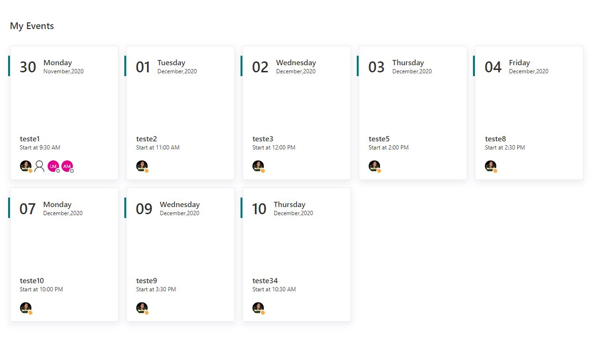

# React-mgtEvents 

## Summary
This sample shows how to use Microsoft Graph Toolkit in SPFx and custom with Fluent UI Fabric Controls

## ScreenShots
 
 
## Used SharePoint Framework Version 

## Applies to

* [SharePoint Framework](https://docs.microsoft.com/sharepoint/dev/spfx/sharepoint-framework-overview)
* [Office 365 tenant](https://docs.microsoft.com/sharepoint/dev/spfx/set-up-your-development-environment)

## Solution

Solution|Author(s)
--------|---------
react-mgtEvents | João Mendes

## Version history

Version|Date|Comments
-------|----|--------
1.0|November 29, 2020|Initial release

## Disclaimer
**THIS CODE IS PROVIDED *AS IS* WITHOUT WARRANTY OF ANY KIND, EITHER EXPRESS OR IMPLIED, INCLUDING ANY IMPLIED WARRANTIES OF FITNESS FOR A PARTICULAR PURPOSE, MERCHANTABILITY, OR NON-INFRINGEMENT.**

---

## Minimal Path to Awesome

If you have not previously granted the required Microsoft Graph permissions, you need to:

- Run `gulp bundle --ship`
- Run `gulp package-solution --ship`
- Install the `.sppkg` file (under `.\sharepoint\solution`) to the SP app catalog
- Approve the API permissions in the new SP admin center

