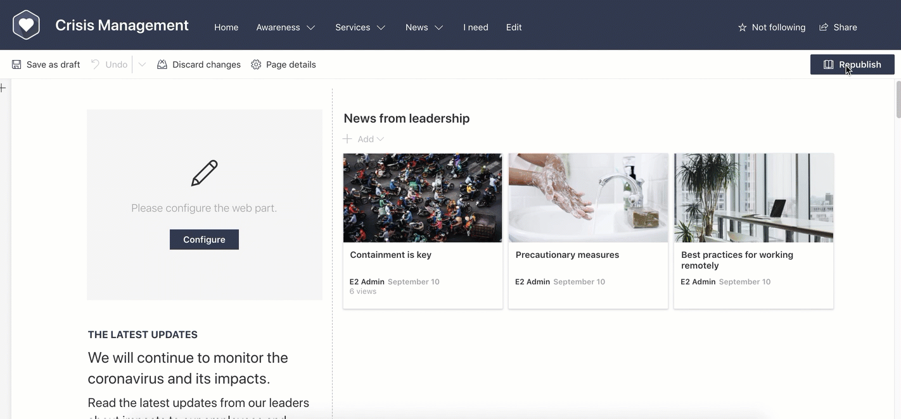

# Target audience generic component

## Summary

Sample web part which uses a Generic React Component which enables it to have Target Audience functionality like what was available in classic web parts.
Targets SharePoint Groups only within the site.



## Compatibility


## Applies to

* [SharePoint Framework](https://docs.microsoft.com/sharepoint/dev/spfx/sharepoint-framework-overview)
* [Office 365 developer tenant](https://docs.microsoft.com/sharepoint/dev/spfx/set-up-your-developer-tenant)

## Solution

Solution|Author(s)
--------|---------
target-audience-generic-component | Rabia Williams([@williamsrabia](https://twitter.com/williamsrabia) , [rabiawilliams.com](https://rabiawilliams.com))

## Version history

Version|Date|Comments
-------|----|--------
1.0|Jan 28, 2020|Initial release

## Disclaimer

**THIS CODE IS PROVIDED *AS IS* WITHOUT WARRANTY OF ANY KIND, EITHER EXPRESS OR IMPLIED, INCLUDING ANY IMPLIED WARRANTIES OF FITNESS FOR A PARTICULAR PURPOSE, MERCHANTABILITY, OR NON-INFRINGEMENT.**

---

## Minimal Path to Awesome

* Clone this repository
* in the command line run:
  * `npm install`
  * `gulp serve`
* Define one or more groups to use as an audience
* Add the web part to a page
* In the web part's properties, select the audience you wish to see the web part

## Features

This Web Part illustrates the following concepts on top of the SharePoint Framework:

* Adding audience targeting to web parts using a generic React component

When the web part is configured, the sample content will only appear to users who belong to the targeted audience.

You can use the `TargetAudience` control (located under `src/common/TargetAudience.tsx`) by inserting one or more in your web parts, specifying the `pageContext` and `groupIds` props, and adding the content you wish to show/hide as children elements of the `TargetAudience` control, as follows:

```tsx
<TargetAudience pageContext={this.props.pageContext} groupIds={this.props.groupIds}>
    <div>
        Your sample content goes here
    </div>
</TargetAudience>
```


